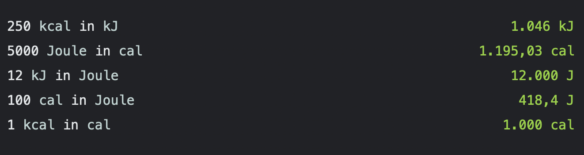

# Food Energy for Numi

## What is this extension for?
This plugin alows you to trqnsform food energy to joule, kilojoule, calories or kilo calories.

- `Joule` / `joule`
- `kJ` / `kilojoule`
- `cal` / `calorie` / `calories` (small calorie)
- `kcal` / `Calories` (food Calories on nutrition labels)

## Install

1. Open Numi.
2. Open the plugins/extensions folder (see Numi wiki).
3. Copy `food-energy.js` into that folder.
4. Reload Numi (or restart the app).

## How to use it?

- `250 kcal in kJ` -> `1046 kJ`
- `250 Calories in kJ` -> `1046 kJ` 
- `100 cal in J` -> `418.4 J`
- `5000 J in kcal` -> `1.195 kcal`
- `12 kJ in J` -> `12000 J`

## Example

